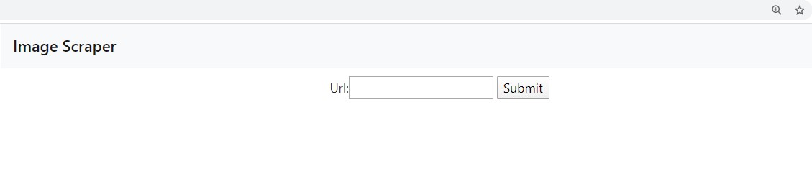
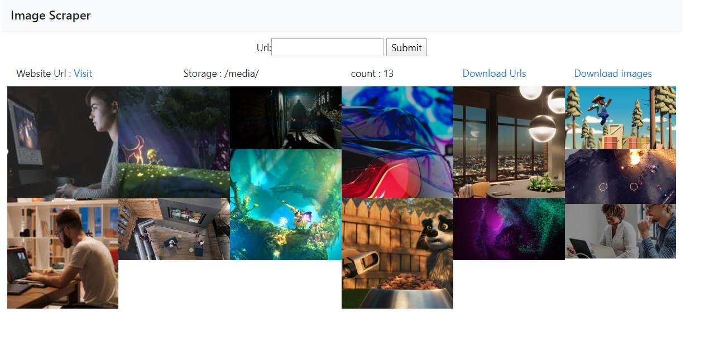
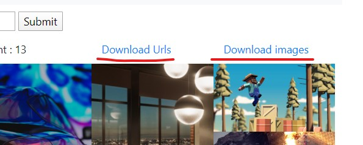
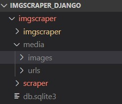

# Image Scraper

This is an implementation of a simple image scraper made in Django using beautifulsoup for scraping. It has a simple frontend to view the images and download them.

## Dependencies

Check Pipfile for details

- beautifulsoup4
- lxml
- requests
- cssutils
- pillow
- python 3.7

## Setup

Clone the repository

```sh
$ git clone https://github.com/rachhek/imagescraper.git
$ cd imagescraper
```

Create a virtual environment and install the dependencies

```sh
$ pipenv shell
$ (imagescraper) pipenv install
```

Once the pipenv has finished installing, run migrations for django.

```sh
$ (imagescraper) python manage.py migrate
```

Run the server

```sh
$ (imagescraper) python manage.py runserver
```

Open the application in http://127.0.0.1:8000/

## Walkthrough

Homepage  


Example of scraping the homepage of http://unity.com  


The Urls and images can be downloaded  


The physical location of the images and txt file of URLs is

```
<path_to_project>/imagescraper/media/
```



## Code

The library for image scraping is located in scraper_app/lib.py
The template for the gallery is located in scraper_app/templates/scraper_app/scraper/index.html

## Limitations

- Cannot download images that are in the form of base64
- Only scrapes "img" tag
- does not automatically scroll pages
- might not properly scrape images for a highly dynamic websites

## Logs

The logs are stored in /imgscraper/debug.log
